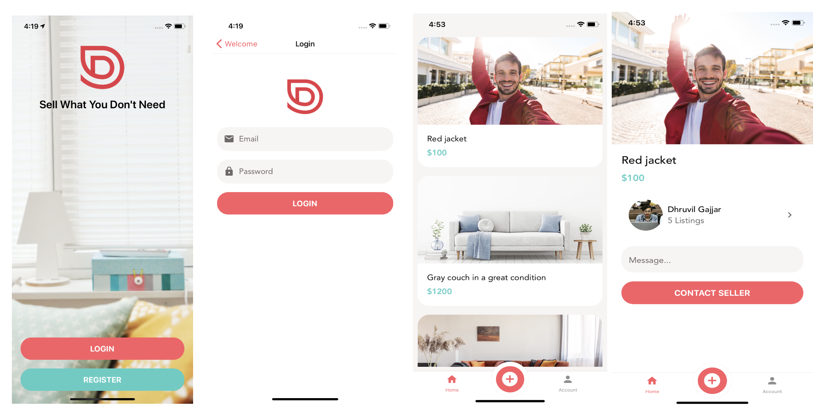

  

        
  

    
    <h1 align="center"> Sale Platform </h1>

    An application for selling stuff.

# How to Run App

  1. Clone this repository  
  2. Find in the project <strong>${Your IP address}</strong> and replace on your ip address  
  2. Open cmd/terminal <strong>'cd backend'</strong> and run command <strong>'node index.js'</strong>  
  3. Then go to <strong>app</strong> folder and run <strong>'expo start'</strong>

## Application features

* `11 Screens` - Welcome, Register, Login, Account, Upload, View Image, Messages, Message Edit, Listings, Listing Edit, and Listing Details Screens.

* `Animation` - Using Lottie (Activity Indicator, done animation and more).

* `Authentication` - User authentication (Register, Login/out) using `Jwt`.

* `Verification` - Send verification email to verify user email using `nodemailer `

* `Real time application` - Send and receive data using `Socket.io`

* `Cache Layer` - Caching Images.

* `Custom and Reusable Hooks` - Api, Auth, and Notifications.

* `Form Validation` - Using Formik.

* `Gesture Handler` - Swipe to delete, and pull to refresh.

* `Navigation` - Using React Navigation and Stack Navigator.

* `Push Notifications` - When messages are received.

* `Reusable Components` - Button, Icon, Forms, Screen, Text, Text Input and more.

* `Splash Screen` - Logo Screen Design while the app is launching.

